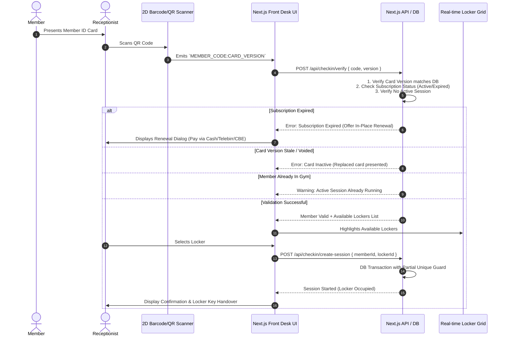
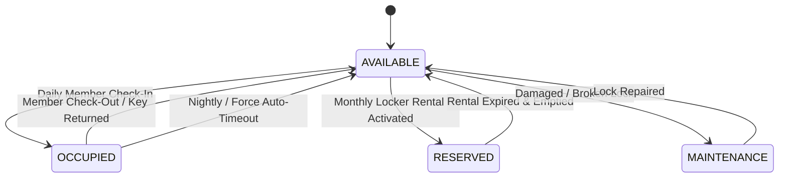

# Blow Fitness — Gym Management System
## Technical Specification, Architectural Critique & Implementation Blueprint

---

## 1. Executive Summary & Context

**Blow Fitness** is a fitness facility operating in Ethiopia that requires an integrated gym management, access control, locker allocation, and point-of-sale (POS) software solution.

The operational environment introduces specific regional and operational requirements:
- **Currency**: Ethiopian Birr (ETB)
- **Local Payment Gateways / Methods**: Telebirr, Commercial Bank of Ethiopia (CBE Birr / Direct Transfer), and Cash with daily shift reconciliation.
- **Calendar Dual-Support**: Ethiopian Calendar (EC) for customer-facing communication and receipts, backed by Gregorian Calendar (GC / UTC) as the system source of truth.
- **Access Hardware**: 2D Barcode / QR scanners at the front desk, thermal receipt printers, and physical member ID cards (PVC/laminated).
- **Physical Asset Control**: Locker management supporting both daily workout session allocation and dedicated long-term (monthly) rentals.

---

## 2. Review & Architectural Critique

The following critical gaps, data integrity risks, and edge cases were identified in the preliminary specification and must be resolved prior to production implementation.

### 2.1 Critical Data Integrity Risks (Severity: High 🔴)

| # | Risk Area | Identified Flaw in Initial Spec | Architectural Fix |
|---|---|---|---|
| **1** | **Locker Double-Assignment** | App logic alone prevents assigning a locker to multiple members; concurrent requests or multi-receptionist race conditions can cause double allocation. | Add a database-level **partial unique index** on `CheckinSession(lockerId) WHERE sessionStatus = 'ACTIVE'`. |
| **2** | **Member Double Check-In** | A member code could be scanned multiple times concurrently, creating orphaned sessions. | Add a partial unique index on `CheckinSession(memberId) WHERE sessionStatus = 'ACTIVE'`. |
| **3** | **Card Reissue Invalidation** | QR codes encode static `memberCode`. If a card is lost and re-issued (100 ETB replacement fee), the old card remains physically readable and valid. | Introduce a `cardVersion` integer or security token that increments on reissue. The QR code must encode `MEMBER_CODE:CARD_VERSION` or a secure signed verification token. |
| **4** | **Monthly Locker Rental Lifecycle** | `rentalType` enum existed without an underlying `LockerRental` table or expiration engine; lockers marked "Reserved" lacked data backing. | Implement a dedicated `LockerRental` entity mirroring `Subscription` with `startDate`, `endDate`, pricing, payment link, and automated status transitions. |
| **5** | **Staff Attribution & RBAC** | `cashierId` was an unreferenced UUID; missing auditability and user authentication. | Introduce a first-class `User` / `Staff` model with hashed credentials, session management, and RBAC (`ADMIN`, `RECEPTIONIST`, `FINANCE_OWNER`). |
| **6** | **Inventory Movement & Audit Log** | Stock quantities were decremented without movement tracking, destroying COGS (Cost of Goods Sold) visibility. | Create a `StockMovement` table recording movement type (`SALE`, `RESTOCK`, `DAMAGE_WRITEOFF`, `ADJUSTMENT`), cost per unit, reference ID, and user ID. |
| **7** | **Ethiopian Calendar Date Drift** | Storing `startDateEC` and `endDateEC` as free-text strings causes desynchronization if Gregorian dates are edited. | Store all dates strictly as UTC Gregorian timestamps (`DateTime`) in PostgreSQL. Compute Ethiopian Calendar dates dynamically on render/print via a tested conversion utility. |

---

### 2.2 Operational & Workflow Edge Cases (Severity: Medium 🟠)

1. **Abandoned Sessions & Auto-Timeout**:
   - If a gym member forgets to check out when leaving, their locker remains "Occupied" indefinitely, causing false capacity shortages.
   - *Resolution*: Implement an automatic session auto-close job (e.g., at gym closing hours or after a configurable 4–6 hour threshold), along with a Front Desk manual override action ("Force Check-Out / Release Locker") requiring staff attribution.
2. **Seamless On-The-Spot Check-In Renewal**:
   - If an expired member scans their card at the turnstile or front desk, the system should allow one-click subscription renewal and locker assignment in a single transactional flow rather than requiring the receptionist to abort and navigate to another page.
3. **Payment Reference Auditing**:
   - Telebirr and CBE transaction codes are manually entered by receptionists.
   - *Resolution*: Enforce format validation (regex matching CBE/Telebirr confirmation code patterns) and maintain a mandatory end-of-day Cash/POS Shift Reconciliation screen where expected digital totals are compared against verified settlement slips.
4. **Order Voids and Returns**:
   - POS sales orders require support for order status (`COMPLETED`, `VOIDED`, `REFUNDED`), recording who authorized the void and restoring inventory via `StockMovement`.
5. **Granular RBAC**:
   - Standard receptionists should not have access to full financial reports, profit margins, or user credential management. Define three explicit roles:
     - `RECEPTIONIST`: Check-in/out, locker assignment, POS checkout, member lookup, new member onboarding.
     - `FINANCE_OWNER`: Financial reports, revenue breakdowns, pricing changes, cash drawer closure audits.
     - `ADMIN`: Full system configuration, staff account management, database maintenance, inventory catalog.

---

### 2.3 Scope & Deployment Phasing (Severity: Low 🟡)

- **Physical Card Printing**: Direct hardware driver integration with high-end PVC card printers (e.g., Evolis, Zebra) requires proprietary native SDKs. For Phase 1 (MVP), implement browser-based high-precision CSS Print formatting calibrated for standard CR80 (85.6mm × 53.98mm) card dimensions, compatible with standard card tray printers or laminated PVC card stock.
- **Offline Fallback Protocol**: Front desk internet/power outages require a local caching strategy or offline operational procedure (such as local SQLite sync or emergency offline check-in paper log reconciliation import).

---

## 3. System Architecture & Workflows

### 3.1 Check-In & Locker Assignment Workflow



---

### 3.2 Locker State Machine



---

## 4. Enhanced Database Schema (Prisma Data Model)

Below is the database architecture incorporating all critical fixes:

```prisma
datasource db {
  provider = "postgresql"
  url      = env("DATABASE_URL")
}

generator client {
  provider = "prisma-client-js"
}

enum Role {
  ADMIN
  FINANCE_OWNER
  RECEPTIONIST
}

enum Gender {
  MALE
  FEMALE
}

enum SubscriptionStatus {
  ACTIVE
  EXPIRED
  CANCELLED
  SUSPENDED
}

enum LockerStatus {
  AVAILABLE
  OCCUPIED
  RESERVED
  MAINTENANCE
}

enum LockerRentalType {
  DAILY_SESSION
  MONTHLY_DEDICATED
}

enum SessionStatus {
  ACTIVE
  COMPLETED
  AUTO_EXPIRED
  FORCE_CLOSED
}

enum PaymentMethod {
  CASH
  TELEBIRR
  CBE_TRANSFER
  OTHER
}

enum StockMovementType {
  RESTOCK
  SALE
  DAMAGE_WRITEOFF
  AUDIT_CORRECTION
}

enum OrderStatus {
  COMPLETED
  VOIDED
  REFUNDED
}

// ----------------------------------------------------
// Staff & Authentication
// ----------------------------------------------------
model User {
  id             String          @id @default(uuid())
  fullName       String
  username       String          @unique
  passwordHash   String
  role           Role            @default(RECEPTIONIST)
  isActive       Boolean         @default(true)
  createdAt      DateTime        @default(now())
  updatedAt      DateTime        @updatedAt

  checkinSessions CheckinSession[]
  salesOrders     SalesOrder[]
  stockMovements  StockMovement[]
  auditLogs       AuditLog[]
  subscriptions   Subscription[]
}

// ----------------------------------------------------
// Members & Identification
// ----------------------------------------------------
model Member {
  id             String          @id @default(uuid())
  memberCode     String          @unique // e.g. "BF-10492"
  cardVersion    Int             @default(1) // Incremented on card replacement
  fullName       String
  phone          String          @unique
  email          String?
  gender         Gender
  photoUrl       String?
  emergencyContactName  String?
  emergencyContactPhone String?
  notes          String?
  isActive       Boolean         @default(true)
  createdAt      DateTime        @default(now())
  updatedAt      DateTime        @updatedAt

  subscriptions   Subscription[]
  checkinSessions CheckinSession[]
  lockerRentals   LockerRental[]
  salesOrders     SalesOrder[]

  @@index([memberCode])
  @@index([phone])
}

// ----------------------------------------------------
// Subscriptions & Plans
// ----------------------------------------------------
model SubscriptionPlan {
  id             String          @id @default(uuid())
  name           String          // e.g. "Monthly Standard", "Quarterly VIP"
  durationDays   Int             // e.g. 30, 90, 365
  priceETB       Decimal         @db.Decimal(10, 2)
  description    String?
  isActive       Boolean         @default(true)
  createdAt      DateTime        @default(now())

  subscriptions  Subscription[]
}

model Subscription {
  id             String             @id @default(uuid())
  memberId       String
  member         Member             @relation(fields: [memberId], references: [id], onDelete: Restrict)
  planId         String
  plan           SubscriptionPlan   @relation(fields: [planId], references: [id], onDelete: Restrict)
  
  startDate      DateTime           // UTC Gregorian single source of truth
  endDate        DateTime           // UTC Gregorian single source of truth
  status         SubscriptionStatus @default(ACTIVE)
  
  amountPaidETB  Decimal            @db.Decimal(10, 2)
  paymentMethod  PaymentMethod
  paymentRef     String?            // Telebirr transaction ID or CBE slip #
  
  processedById  String
  processedBy    User               @relation(fields: [processedById], references: [id])
  
  createdAt      DateTime           @default(now())
  updatedAt      DateTime           @updatedAt

  @@index([memberId, status])
  @@index([endDate])
}

// ----------------------------------------------------
// Lockers & Attendance Sessions
// ----------------------------------------------------
model Locker {
  id             String          @id @default(uuid())
  lockerNumber   String          @unique // e.g. "01", "02", "A-12"
  section        String          // "MALE_LOCKER_ROOM", "FEMALE_LOCKER_ROOM", etc.
  status         LockerStatus    @default(AVAILABLE)
  notes          String?

  checkinSessions CheckinSession[]
  lockerRentals   LockerRental[]

  @@index([section, status])
}

model LockerRental {
  id             String          @id @default(uuid())
  lockerId       String
  locker         Locker          @relation(fields: [lockerId], references: [id])
  memberId       String
  member         Member          @relation(fields: [memberId], references: [id])
  
  startDate      DateTime
  endDate        DateTime
  priceETB       Decimal         @db.Decimal(10, 2)
  paymentMethod  PaymentMethod
  paymentRef     String?
  isActive       Boolean         @default(true)
  
  createdAt      DateTime        @default(now())
  updatedAt      DateTime        @updatedAt

  @@index([lockerId, isActive])
  @@index([memberId])
}

model CheckinSession {
  id             String          @id @default(uuid())
  memberId       String
  member         Member          @relation(fields: [memberId], references: [id])
  lockerId       String?
  locker         Locker?         @relation(fields: [lockerId], references: [id])
  
  checkinTime    DateTime        @default(now())
  checkoutTime   DateTime?
  sessionStatus  SessionStatus   @default(ACTIVE)
  
  receptionistId String
  receptionist   User            @relation(fields: [receptionistId], references: [id])

  // Database-Level Partial Unique Constraints to eliminate race conditions:
  // 1. A locker cannot have more than one ACTIVE session simultaneously.
  // 2. A member cannot have more than one ACTIVE session simultaneously.
  @@index([sessionStatus, checkinTime])
  @@index([memberId, sessionStatus])
  @@index([lockerId, sessionStatus])
}

// ----------------------------------------------------
// POS & Inventory Tracking
// ----------------------------------------------------
model ProductCategory {
  id             String          @id @default(uuid())
  name           String          @unique // e.g. "Beverages", "Supplements", "Merchandise"
  products       Product[]
}

model Product {
  id             String          @id @default(uuid())
  categoryId     String
  category       ProductCategory @relation(fields: [categoryId], references: [id])
  barcode        String?         @unique
  name           String
  costPriceETB   Decimal         @db.Decimal(10, 2)
  sellingPriceETB Decimal        @db.Decimal(10, 2)
  currentStock   Int             @default(0)
  reorderLevel   Int             @default(5)
  isActive       Boolean         @default(true)
  createdAt      DateTime        @default(now())
  updatedAt      DateTime        @updatedAt

  orderItems     SalesOrderItem[]
  stockMovements StockMovement[]

  @@index([barcode])
  @@index([categoryId])
}

model StockMovement {
  id             String            @id @default(uuid())
  productId      String
  product        Product           @relation(fields: [productId], references: [id])
  type           StockMovementType
  quantity       Int               // positive for additions, negative for decrements
  unitCostETB    Decimal?          @db.Decimal(10, 2)
  reason         String?
  referenceId    String?           // links to SalesOrderId or PurchaseInvoice
  createdById    String
  createdBy      User              @relation(fields: [createdById], references: [id])
  createdAt      DateTime          @default(now())

  @@index([productId, createdAt])
}

model SalesOrder {
  id             String          @id @default(uuid())
  orderNumber    String          @unique // e.g. "SO-2026-0001"
  memberId       String?
  member         Member?         @relation(fields: [memberId], references: [id])
  
  totalAmountETB Decimal         @db.Decimal(10, 2)
  paymentMethod  PaymentMethod
  paymentRef     String?
  status         OrderStatus     @default(COMPLETED)
  
  cashierId      String
  cashier        User            @relation(fields: [cashierId], references: [id])
  
  createdAt      DateTime        @default(now())
  updatedAt      DateTime        @updatedAt

  items          SalesOrderItem[]

  @@index([createdAt, status])
  @@index([cashierId])
}

model SalesOrderItem {
  id             String          @id @default(uuid())
  orderId        String
  order          SalesOrder      @relation(fields: [orderId], references: [id], onDelete: Cascade)
  productId      String
  product        Product         @relation(fields: [productId], references: [id])
  
  quantity       Int
  unitPriceETB   Decimal         @db.Decimal(10, 2)
  costPriceETB   Decimal         @db.Decimal(10, 2) // Captured at moment of sale for accurate COGS
  subtotalETB    Decimal         @db.Decimal(10, 2)
}

// ----------------------------------------------------
// System Audit Log
// ----------------------------------------------------
model AuditLog {
  id             String          @id @default(uuid())
  userId         String?
  user           User?           @relation(fields: [userId], references: [id])
  action         String          // e.g. "CARD_REPLACED", "SESSION_FORCE_CLOSED", "STOCK_ADJUSTMENT"
  entityType     String          // e.g. "Member", "CheckinSession", "Product"
  entityId       String
  detailsJson    String?         // JSON snapshot of change
  ipAddress      String?
  createdAt      DateTime        @default(now())

  @@index([entityType, entityId])
  @@index([createdAt])
}
```

> **PostgreSQL Migration Note for Partial Unique Indexes:**
> Prisma does not yet support partial unique indexes natively in the schema DSL. We enforce them in raw SQL migrations:
> ```sql
> -- Prevent double active sessions for the same locker
> CREATE UNIQUE INDEX unique_active_locker_session 
> ON "CheckinSession" ("lockerId") 
> WHERE "sessionStatus" = 'ACTIVE' AND "lockerId" IS NOT NULL;
>
> -- Prevent double active check-ins for the same member
> CREATE UNIQUE INDEX unique_active_member_session 
> ON "CheckinSession" ("memberId") 
> WHERE "sessionStatus" = 'ACTIVE';
> ```

---

## 5. Ethiopian Calendar (EC) Integration Architecture

1. **Storage Rule**: Never store Ethiopian Calendar dates as primary fields or editable strings. All timestamps are UTC Gregorian `DateTime`.
2. **Runtime Conversion**: An Ethiopian Calendar converter utility (`lib/calendar/ethiopian.ts`) translates between Gregorian Date objects and Ethiopian Day/Month/Year strings:
   - Example: `2026-09-03` GC $\rightarrow$ `2018-12-28` EC (Pagume month handling included).
3. **Display Strategy**:
   - Customer-facing receipts and card printouts show both: e.g., `Valid Until: 2026-10-02 (2019-01-22 E.C.)`.
   - Front desk input datepickers allow entering dates in either format, automatically translating to ISO UTC Gregorian before persisting to PostgreSQL.

---

## 6. Physical Member Card Printing Specification

- **Card Standard**: ISO/IEC 7810 ID-1 / CR80 standard (85.60 mm × 53.98 mm, rounded corners 3.18 mm).
- **Format**: High-DPI CSS Print Template (`@media print` stylesheet) configured for borderless PVC card printing.
- **Card Content Elements**:
  1. Gym Brand Logo & Facility Name ("Blow Fitness").
  2. Member Headshot Photo (`photoUrl` or instant webcam snapshot).
  3. Member Name & Unique ID Code (`BF-XXXXX`).
  4. Dynamic High-Density QR Code containing:
     ```json
     {"code":"BF-10492","v":2,"t":"7f9a2b..."}
     ```
     *(Includes `v` card version to instantly reject older/lost printed cards).*
  5. Membership Expiration Date (dual GC & EC).
  6. Emergency Contact & Terms on reverse side.

---

## 7. Next Implementation Steps & Options

| Phase | Milestone | Deliverables |
|---|---|---|
| **Phase 1** | **Project Scaffold & Database** | Next.js App Router, Prisma ORM, PostgreSQL connection, migrations with partial unique indexes, seed data. |
| **Phase 2** | **Authentication & RBAC** | JWT / Session auth, Role middleware (`ADMIN`, `RECEPTIONIST`, `FINANCE_OWNER`), staff management. |
| **Phase 3** | **Members & Card Generator** | Member registration, webcam snapshot, card versioning, printable CR80 PVC card template. |
| **Phase 4** | **Check-in Desk & Real-Time Locker Grid** | Scanner input listener, subscription validation, interactive locker grid with live status colors (Available/Occupied/Reserved/Maintenance). |
| **Phase 5** | **POS & Inventory Engine** | Product catalog, barcode-assisted cart, Cash / Telebirr / CBE payment reference capture, stock movement audit trail. |
| **Phase 6** | **Reports & Daily Cash Drawer Closure** | End-of-day shift reconciliation, attendance logs, revenue breakdown by payment method. |
